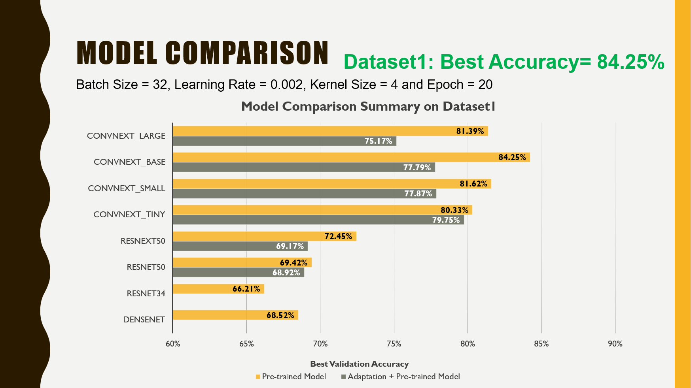
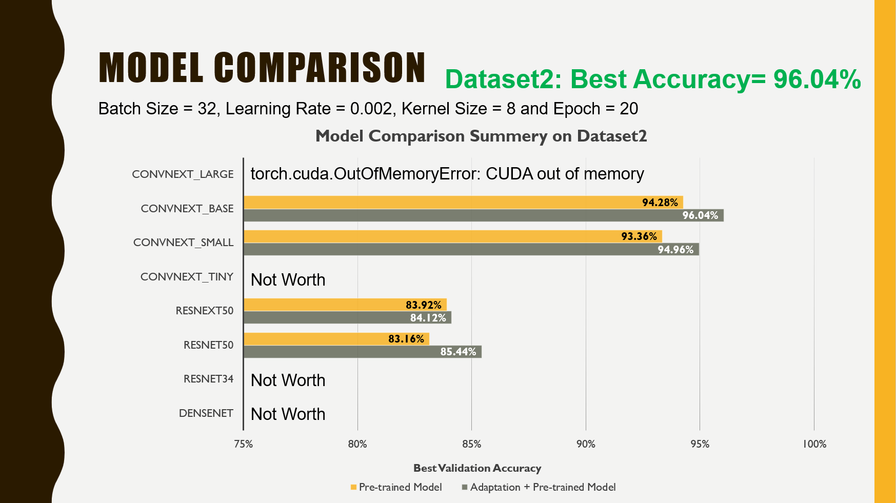
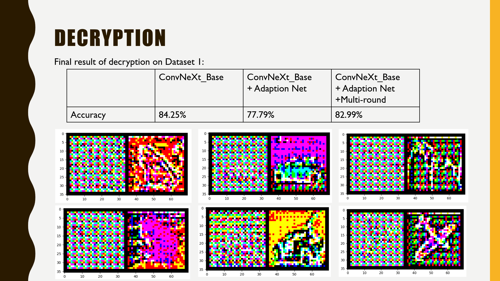

This project is basically mapping the real-world case of privacy-preserving deep learning. In this project, we performed both roles as a service provider and an eavesdropper. We proposed an Encryption-Robust (ER) model for privacy-preserving deep learning. The ER model is based on a regular CNN classification model and an adaptation network. The adaptation network was developed using convolution to perform the decryption. In total eight pre-trained models applied in this project, ConvNeXt-Base outperformed others and achieved highest accuracy values for both dataset 1 (84.25% as the highest for dataset 1) and dataset 2 (94.28%) provided. Adaptation network and multi-round training strategy were then applied with ConvNeXt-Base to do the decryption. It achieved an improvement on decryption on dataset1 and performed outstandingly on dataset 2. Moreover, the accuracy value was further increased to 96.72% (as the highest for dataset 2) with the application of adaptation network and multi-round training strategy.

A flaw was realized that pretrained ConvNeXt-Base has already seen and memorized all of the original images from dataset 2 thus the results on dataset 2 were possibly not solid. To ensure no-overlapping on images for pretraining and decryption, two different approaches were developed. The first approach using self-pretrained ResNet50 model showed that adaptation network after multi-round training can have an effective decryption capacity. The second approach using images from imageNet21k doesn’t show good decryption. One possible reason is that the dataset used in approach two is more complicated with multiple types of objects contained in a single class. Time limitation is another reason.

Results are shown below. 

Our Team as a Service Provider:

Best Validation Accuracy on Dataset1: 84.25%

Best Validation Accuracy on Dataset2: 96.72%

Our Team as an eavesdropper:

Category Recognition on Dataset1: A Selected Few

Category Recognition on Dataset2: Almost 50

 

